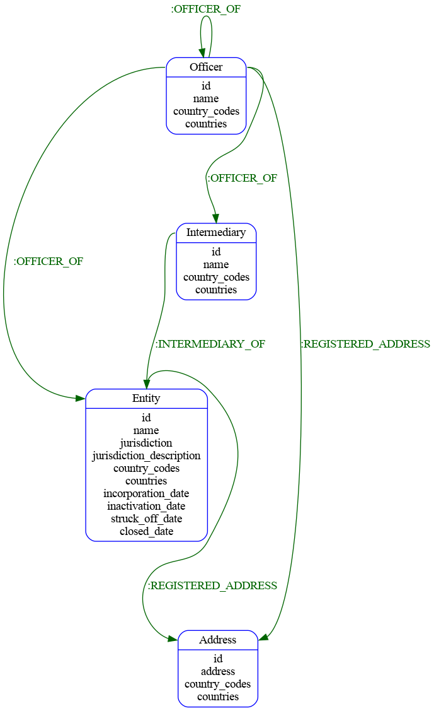

# Panama Papers in Redis Graph

## Data Download Location
https://offshoreleaks.icij.org/pages/database

Download the zip file from above into the data_download diretory and unzip

## Clean the data

```
./run_all.sh
```

## Install the bulk loader and Load the data

```
pip3 install git+https://github.com/RedisGraph/redisgraph-bulk-loader.git@master
~/bin/redisgraph-bulk-loader PANAMA -n data_download/Officer.csv\
 -n data_download/Entity.csv  -n data_download/Address.csv \
 -n data_download/Intermediary.csv  -r ./data_download/INTERMEDIARY_OF.csv \
 -r ./data_download/OFFICER_OF.csv -r ./data_download/REGISTERED_ADDRESS.csv
```

## Query Away!!

create some full text searching for some fun

```
GRAPH.QUERY PANAMA "CALL db.idx.fulltext.createNodeIndex('Address', 'address')"
GRAPH.QUERY PANAMA "CALL db.idx.fulltext.createNodeIndex('Entity', 'name')"
```


